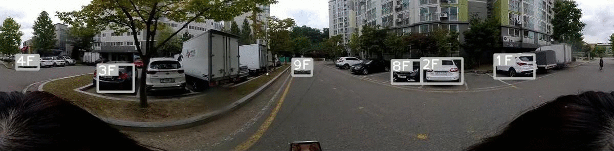
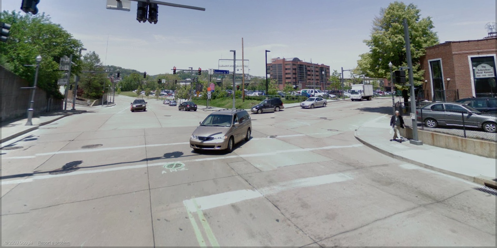
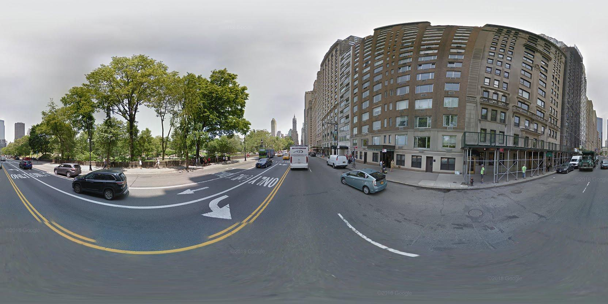
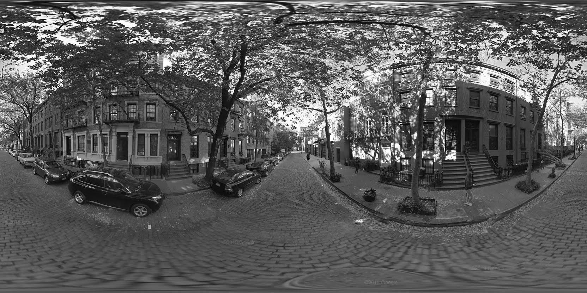

# 360도 카메라와 Object Tracking을 이용한 보행시 차량 접근 알림




## 프로젝트 설명

이 프로젝트는 PyTorch를 활용한 DeepSORT 알고리즘(https://github.com/ZQPei/deep_sort_pytorch)에 커스텀 YOLOv5를 도입하여 360도 영상에서 차량을 감지 및 추적합니다. 360도 카메라를 착용한 보행자가 다가오는 차량에 경고 알림을 받을 수 있게 하여 보행 중 스마트 기기를 사용하는 주의 분산 보행자, 노인, 어린이와 같은 교통 약자의 안전한 보행을 보장하고자 합니다.

## 시스템 작동 방식

영상에서 차량이 감지되면 해당 차량에 대해 추적을 시작합니다. 우리의 관심 대상, 즉 위험차량인 "보행자에게 다가오는 차량"은 360도 영상에서 정면 형태로 표현됩니다. 따라서 다음과 같은 필터링 알고리즘으로 비위험 차량을 제외합니다.
## 데이터셋

모델의 성능을 향상시키기 위해 다양한 데이터셋을 사용해 여러 차례 모델을 학습시켰습니다.

- D1: Google Street View (https://www.crcv.ucf.edu/data/GMCP_Geolocalization/#Dataset)



- D2: Streetlearn (https://sites.google.com/view/streetlearn/dataset?authuser=0)



- D3: D1 + D3 (채택)

\* Augmentation: 모델이 밤 영상에서 모델의 정확도가 감소하는 현상을 개선하기 위해 다음과 같은 코드를 사용해 D3 데이터셋을 grayscale로 변환했습니다.

```python
img = Image.open(img_path).convert('L')
img_numpy = np.array(img,'uint8')
cv2.imwrite(img_path,img_numpy)
```



## 필터링 알고리즘

필터링 알고리즘은 4단계로 구성되며 바운딩박스의 중점좌표, 면적 등 바운딩박스 정보를 사용합니다. 매 프레임마다 isCloser 변수는 T의 초기값을 가지며 비위험차량이라면 필터링 알고리즘을 거치면서 F값으로 변경됩니다. 모든 단계가 끝난 뒤에도 T값인 차량은 위험차량이 됩니다. 또한 최초 감지 시 차량의 isCloser는 F값으로 설정됩니다.

모든 필터링 기준은 실험을 통해 경험적으로 구했습니다.

1단계: 위험거리보다 멀리 있는 차량을 필터링

```python
if isCloser == True and box_size < 1000: isCloser = False
```

2단계: 측면차량을 필터링

```python
if isCloser == True and box_ratio > 1.5: isCloser = False
```

3단계: 주차된 차량을 필터링

```python
if isCloser == True and track_id in dict and abs(dict[track_id][0] - x_center) > 5: isCloser = False
if isCloser == True and track_id in dict and abs((dict[track_id][1] - box_size) / dict[track_id][1]) < 0.055: isCloser = False
elif track_id in dict and dict[track_id][1] == False: isCloser = False
```

\* 보행자가 움직일 때 주차된 차량의 이전 프레임 대비 바운딩박스 중점좌표 x값의 변화는 5보다 크며, 보행자가 멈춰있을 때 이전 프레임 대비 바운딩박스 크기 변화율은 0.055의 오차 범위 내에서 일정하게 유지된다는 점을 기반으로 설정한 조건입니다.

4단계: 멀어지는 차량을 필터링

```python
if isCloser == True and track_id in dict and dict[track_id][1] > box_size: isCloser = False
```

## 차량 접근 경고

360도 영상은 그 특성상 바운딩박스 중점좌표의 x값을 활용하면 객체의 접근 방향을 도출할 수 있습니다. 이를 시각화하여 휴대폰 어플 등으로 보여줄 수 있도록 차트를 생성합니다.

```python
angle = x/width * 2 * math.pi #radian
angle *= 57.295779513 #degree
```

## Requirements

Python 3.8 이상에서 1.6 버전 이상의 torch 및 requirements.txt의 모든 dependency를 설치합니다. 설치를 위해 다음을 실행합니다.

`pip install -U -r requirements.txt`

모든 dependency는 관련된 docker 이미지를 포함합니다. Docker requirement는 다음과 같습니다.
- `nvidia-docker`
- Nvidia Driver Version >= 440.44

## Tracker 사용 전 설치 사항

Github의 파일 용량 제한으로 업로드 되지 않은 다음 파일을 추가로 설치해야 합니다.

- 커스텀 YOLOv5 Weight `.pt` 파일: https://drive.google.com/file/d/17d9hKpUKKsk_MvIPgKlfDPjpx7ybAE9h/view?usp=sharing 
- DeepSort Weight `.t7` 파일: https://drive.google.com/drive/folders/1xhG0kRH1EX5B9_Iz8gQJb7UNnn_riXi6. (`deep_sort/deep/checkpoint/`에 위치)

## Tracking

Tracking은 대부분의 영상 포맷을 지원합니다. 결과 영상은 `./inference/output`에 저장됩니다.

```bash
python3 track.py --source ...
```

- 영상:  `--source file.mp4`
- RTSP stream:  `--source rtsp://170.93.143.139/rtplive/470011e600ef003a004ee33696235daa`
- HTTP stream:  `--source http://wmccpinetop.axiscam.net/mjpg/video.mjpg`

## 참고 자료

이 프로젝트는 다음과 같은 자료를 참고했습니다.

- Deep Sort with PyTorch
  https://github.com/ZQPei/deep_sort_pytorch
- Yolov5 + Deep Sort with PyTorch
  https://github.com/mikel-brostrom/Yolov5_DeepSort_Pytorch
- 

## 기타

For more detailed information about the algorithms and their corresponding lisences used in this project access their official github implementations.